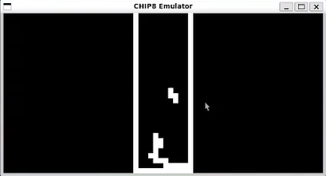
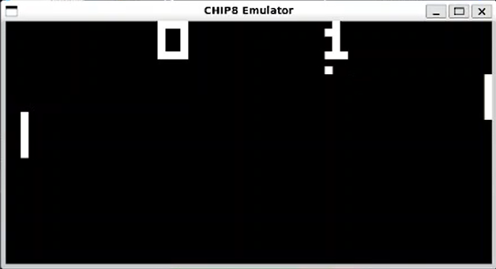
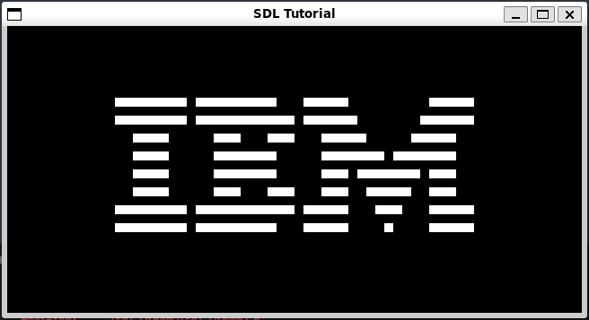

# CHIP-8 Emulator 🕹️

This project attempts to emulate a [CHIP-8](https://en.wikipedia.org/wiki/CHIP-8) system using idiomatic C++. This project follows the specifications from [Cowgod](http://devernay.free.fr/hacks/chip8/C8TECH10.HTM). The graphics were created with [SDL 2](https://www.libsdl.org/). Tests were created with [GoogleTest](http://google.github.io/googletest/). 

## Examples








## Getting Started

After cloning the repository, execute the following from the project directory:
```
mkdir build
cd build
cmake ..
make
```

Usage:
```
./main <window scale> <delay in ms> </path/to/rom>
```

For example:

```
./main 10 2 ../demo-roms/tetris.ch8
```

To run the tests execute the following:
```
cd build
ctest
```

## Credits
https://austinmorlan.com/posts/chip8_emulator/: Learning resource

https://tobiasvl.github.io/blog/write-a-chip-8-emulator/: Learning resource

https://github.com/corax89/chip8-test-rom/blob/master/README.md: opcode_test.ch8

https://github.com/dmatlack/chip8/tree/master/roms: Remaining ROMs (Credits are listed in the repo)
